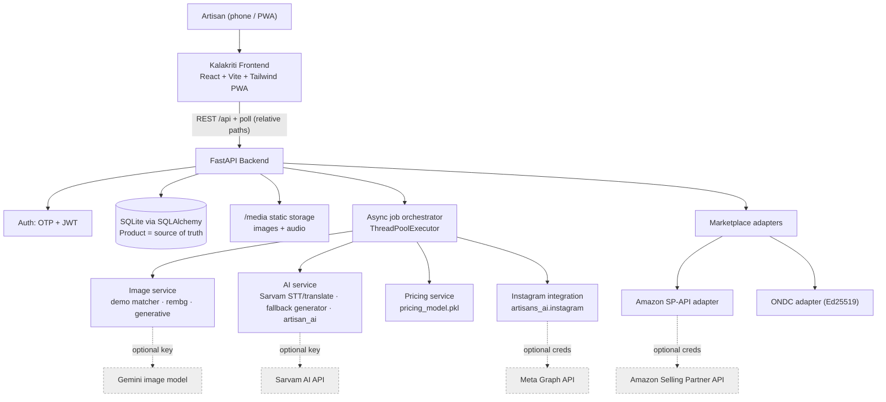
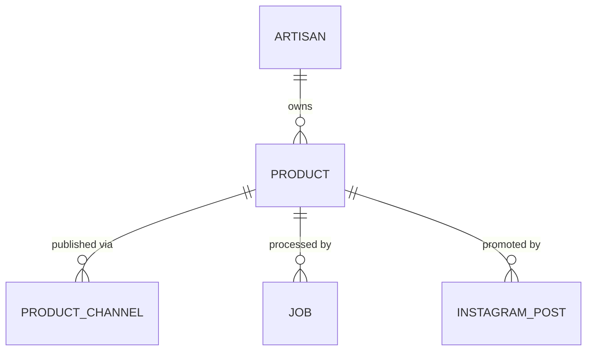

# Kalakriti

**Kalakriti is an AI-assisted digital-enablement platform that turns an artisan's product photo and spoken description into a professional, marketplace-ready product listing — and demonstrates automated distribution to online marketplaces (Amazon, ONDC) and social commerce (Instagram) with minimal technical effort from the artisan.**

Built for **Smart India Hackathon (SIH) 2026** as a mobile-first, multilingual (English / Hindi / Punjabi) Progressive Web App.

> The design goal: an artisan should be able to say *"I just showed the app my product — it did everything else."*

---

## ⚠️ Read this first — how to read this README (honesty statement)

This project is a **working end-to-end prototype with a deliberate demo layer** so it can be shown reliably in an interview room without live seller accounts, GPUs, or paid API quotas. Throughout this document, every capability is tagged so an evaluator knows exactly what is real:

| Tag | Meaning |
|---|---|
| ✅ **WORKING** | Actually implemented and runs end-to-end (some require a server-side API key, noted inline). |
| 🎭 **DEMO / SIMULATED** | Intentionally simulated or curated for the hackathon. Clearly labelled in the UI too — never claimed to be a live external action. |
| 🟡 **PARTIAL** | Real code and structure exist, but the path is not fully wired to a live external endpoint or has not been verified against a real production account. |
| 🔮 **FUTURE SCOPE** | Not built yet; described as a roadmap item. |

Nothing in this README claims a live integration where the code only simulates one. Where behaviour depends on a configuration flag or key, that is stated explicitly.

---

## Table of contents

1. [Executive summary](#1-executive-summary)
2. [Problem statement](#2-problem-statement)
3. [Proposed solution](#3-proposed-solution)
4. [Key features](#4-key-features)
5. [User journey](#5-user-journey)
6. [System architecture](#6-system-architecture)
7. [The automated pipeline, step by step](#7-the-automated-pipeline-step-by-step)
8. [AI / ML components (what is real)](#8-ai--ml-components-what-is-real)
9. [Marketplace & social integrations (what is real)](#9-marketplace--social-integrations-what-is-real)
10. [Demo / simulation layer](#10-demo--simulation-layer)
11. [Tech stack](#11-tech-stack)
12. [Repository structure](#12-repository-structure)
13. [Data model](#13-data-model)
14. [API reference](#14-api-reference)
15. [Configuration & environment variables](#15-configuration--environment-variables)
16. [Running locally](#16-running-locally)
17. [Deployment](#17-deployment)
18. [Implementation status matrix](#18-implementation-status-matrix)
19. [Security & privacy](#19-security--privacy)
20. [Testing](#20-testing)
21. [Known limitations](#21-known-limitations)
22. [Future scope](#22-future-scope)
23. [Interview quick-reference / FAQ](#23-interview-quick-reference--faq)

---

## 1. Executive summary

**What it is.** Kalakriti is a mobile-first web application (installable as a PWA) that lets a traditional artisan create a complete, professional online product listing using only two natural inputs they already have: **a photo of the product** and **their own voice** describing it, in their own language. The system handles the digital work an artisan usually cannot do alone — professional product photography, English marketing copy, an "artisan story", a recommended price, and publishing to selling channels.

**What problem it solves.** India's artisans make world-class products but are largely locked out of digital commerce by a *digital-skills barrier*, not a product-quality barrier. Marketplaces demand studio photos, English SEO-friendly descriptions, category/attribute metadata, and pricing decisions — each a separate technical skill. Kalakriti collapses that entire workflow into "photo + voice" and automates the rest.

**Who the users are.**
- **Primary:** individual artisans and small craft producers with low digital literacy, often more comfortable speaking a regional language than typing English.
- **Secondary (admin/platform):** a platform operator who runs the shared brand social channel and monitors the content pipeline.

**Why it matters.** Removing the digital barrier connects artisan income directly to national and global demand — supporting livelihoods, preserving craft, and aligning with Digital India / ONDC's goal of democratizing e-commerce.

**What makes it different.**
- **Voice-first and multilingual** — the artisan never has to read or fill an English form. Pricing inputs (category, material, size, cost) are *inferred from what they said*, not asked as form fields.
- **Canonical-product architecture** — one product record is the single source of truth; every marketplace/social channel is a pluggable adapter over it, so distribution scales without touching the core pipeline.
- **Honest AI with graceful fallback** — every AI model sits behind a clean interface with a deterministic, *non-fabricating* fallback, so the app runs end-to-end with no GPU and no keys, and upgrades to full models purely via configuration.
- **A reliable demo layer** — curated before/after photography and simulated publishing let the full journey be demonstrated convincingly without live seller onboarding.

**How AI reduces the artisan's burden.** Speech-to-text + translation converts spoken regional-language input into structured product facts and English marketing copy; a trained regression model recommends a fair price; a background-removal/staging pipeline (or a generative model, when configured) produces studio-grade photos; a social-content pipeline decides what is worth posting and writes the caption. The artisan only *reviews and confirms*.

---

## 2. Problem statement

Traditional artisans face a stack of **digital barriers** between a finished physical product and an actual online sale:

- **Limited digital literacy** — many are unfamiliar with marketplace seller dashboards, forms, and English UIs.
- **Professional photography** — marketplaces expect clean, well-lit, background-isolated studio shots; artisans typically have a single phone photo taken at their workbench.
- **Writing descriptions** — a compelling, keyword-rich English product description is a copywriting skill, not a craft skill.
- **Pricing** — deciding a fair, competitive price requires market awareness most artisans don't have access to.
- **Structuring information** — marketplaces need category, material, dimensions, and attributes as structured metadata; the artisan has this knowledge only as spoken, unstructured description.
- **Language** — the artisan's fluent language is often Hindi, Punjabi, or another regional language; the marketplace's is English.
- **Marketplace access & onboarding** — seller registration, identity verification, and catalog APIs are complex.
- **Cross-platform maintenance** — keeping the same product consistent across Amazon, ONDC, Instagram, etc. is fragmented, manual work.
- **Social discovery** — using Instagram/social media effectively for product discovery is a marketing discipline of its own.

**The core framing:**

```
ARTISAN  ──►  [ DIGITAL BARRIER ]  ──►  MARKET ACCESS
  (craft + voice)   (photos, copy,        (Amazon, ONDC,
                     pricing, metadata,     Instagram, buyers)
                     English, APIs)
```

Kalakriti's thesis: **the barrier is digital skills, not product quality.** So automate the digital skills and let the artisan keep doing what they do best.

*(Note: the problem framing above reflects the product's stated intent as expressed in the codebase and UI. It is a design rationale, not a claim of external field research included in this repo.)*

---

## 3. Proposed solution

Kalakriti's end-to-end workflow (each step maps to real code; see [§7](#7-the-automated-pipeline-step-by-step)):

```
Artisan registration (phone OTP)                 ✅
        ↓
Language selection (EN / HI / PA)                ✅
        ↓
Product image upload (camera / gallery)          ✅
        ↓
Voice input (speak in own language)              ✅
        ↓
Speech-to-text + translation (Sarvam)            ✅ (needs SARVAM_API_KEY)
        ↓
Artisan reviews / edits the transcript           ✅
        ↓
Professional product photography                 ✅ demo curated + ✅ real rembg staging + 🟡 generative (needs key)
   (Hero / Lifestyle / Detail)
        ↓
Product description + highlights + keywords      ✅ (grounded fallback generator; 🟡 full LLM pipeline when enabled)
        ↓
Artisan story                                    ✅
        ↓
AI price recommendation                          ✅ (trained scikit-learn model)
        ↓
Product preview / review                         ✅
        ↓
Publish to marketplaces (Amazon / ONDC)          🎭 simulated in demo mode · 🟡/✅ real adapter code when configured
        ↓
Social commerce (Instagram automation)           ✅ pipeline · 🎭 simulated publish in demo mode
        ↓
Engagement feedback / analytics                  🎭 simulated engagement feeding a real feedback loop
```

**What is automatic vs. what needs the artisan's confirmation:**
- **Automatic:** photography, transcription→English, description, story, pricing inputs inference, price suggestion, listing assembly, Instagram eligibility scoring + caption.
- **Requires the artisan's explicit action:** confirming/editing the transcript, adjusting the final price, approving the listing, and choosing to publish.

---

## 4. Key features

| Feature | What it does | Technology | Status |
|---|---|---|---|
| Phone-OTP login | Passwordless auth; OTP returned in-response in dev mode so judges log in with no SMS gateway | FastAPI, JWT (PyJWT), HMAC-hashed OTP | ✅ (OTP shown in dev mode 🎭) |
| Multilingual UI | Full English / Hindi / Punjabi interface with per-key JSON locales | React context i18n, `locales/{en,hi,pa}.json` | ✅ |
| Voice input (STT) | Records mic audio, converts to 16 kHz mono WAV, transcribes in the spoken language | Web Audio PCM capture; Sarvam `speech-to-text` | ✅ (needs `SARVAM_API_KEY`) |
| Speech→English | Translates the confirmed transcript to English for marketplace copy | Sarvam `translate` | ✅ (needs key) |
| Text-to-speech | Speaker buttons read UI/content aloud; browser SpeechSynthesis fallback for all languages | Sarvam `text-to-speech` (bulbul:v3) + browser `speechSynthesis` | ✅ (browser TTS works with no key) |
| AI product photoshoot — curated demo | Known reference photos short-circuit to supplied professional AFTER images (Hero/Lifestyle/Detail) | SHA-256 + perceptual-hash matcher over `before_after_products/` | 🎭 DEMO |
| AI product photoshoot — real isolation | Removes hand/background from any photo and stages it into 3 studio shots | `rembg` (u2net/u2netp) + Pillow compositing + phash validation | ✅ (CPU, no key) |
| AI product photoshoot — generative | True scene synthesis / image-to-image | Gemini image model / OpenAI / hosted FLUX (pluggable provider) | 🟡 (needs `GEMINI_API_KEY`/provider; auto-enables when key present) |
| Product description + highlights + keywords | Generates listing copy grounded strictly in artisan-provided facts (never invents materials/claims) | Deterministic fallback generator (`ai_service.py`); full `artisan_ai` LLM pipeline when enabled | ✅ fallback · 🟡 full pipeline |
| Artisan story | Short provenance narrative from maker + region + materials | Same generator | ✅ |
| Price recommendation | Predicts a fair price and range with a cost-floor and reasoning | Trained scikit-learn pipeline (`pricing_model.pkl`) | ✅ |
| Pricing-input inference | Infers category/material/size/cost from what the artisan *said* (EN + Hindi/Hinglish keywords) — no form | Keyword mapping (`inference.py`) | ✅ |
| Comparable-listing pricing | Nearest-neighbour price context from reference listings | sentence-transformers + cosine similarity | 🟡 (optional; skipped — reference CSV/embeddings not shipped) |
| Canonical product + channels | One product record; per-marketplace state decoupled into channel rows | SQLAlchemy models | ✅ |
| Async pipeline + live progress | Background job runs the pipeline; UI polls step-by-step progress | ThreadPoolExecutor + `Job.steps` polling | ✅ |
| Amazon publishing | Maps product → SP-API Listings item and PUTs it | Amazon SP-API (LWA + Listings 2021-08-01), httpx | 🟡 real client code, gated by creds, sandbox default, unverified against a live seller account · 🎭 simulated in demo |
| ONDC publishing | Maps product → ONDC catalog item + builds signed auth header | Ed25519 (PyNaCl), BLAKE-512 digest | 🟡 mapping + signing implemented; live SNP transport not wired · 🎭 simulated in demo |
| Instagram automation | Scores post-worthiness, safety-checks, writes caption, formats creative, schedules | `artisans_ai.instagram` package | ✅ pipeline runs · 🎭 publish simulated in demo |
| Instagram admin view | Platform dashboard: evaluated/selected/scheduled/held counts, recent posts, simulate engagement | React page + `/admin/instagram/*` | ✅ |
| Simulated engagement + feedback loop | Fabricates plausible metrics that feed the package's real recalibration logic | `random` + `FeedbackStore` (JSONL) | 🎭 metrics simulated → ✅ real feedback loop |
| Demo marketplace pages | Public listing pages judges can open without logging in | `/demo/{channel}/product/{id}`, `/demo/instagram/post/{id}` | 🎭 DEMO |
| PWA / installable | Manifest + service worker + maskable icons; installs as "Kalakriti" | Vite, `manifest.webmanifest`, `sw.js` | ✅ |
| Admin health/status | Reports which AI/marketplace/IG modes are live vs. fallback (no secrets) | `/api/admin/health`, `/api/admin/image/info` | ✅ |

---

## 5. User journey

A non-technical artisan's path through the app (routes in `app/frontend/src/App.jsx`):

1. **Open Kalakriti** (browser or installed PWA).
2. **Choose language** — English, Hindi, or Punjabi (`/language`). Must be chosen before login.
3. **Log in** with phone number + OTP (`/login`). In demo mode the OTP is shown on screen, so no SMS gateway is needed.
4. **Set up profile once** (`/onboarding`) — name, craft, location, optional business name. Not asked again per product.
5. **Add a product** (`/add`):
   - **Step 1 — Photos:** take/upload one or more product photos.
   - **Step 2 — Speak:** tap the mic and describe the product in their own language; the app transcribes it, and the artisan can **edit any word** or type instead.
   - **Step 3 — Processing:** the app shows live progress ("Understanding your product → Creating professional product photos → …") while the background pipeline runs.
6. **Review the listing** (`/product/:id`) — sees the AI photoshoot (Hero/Lifestyle/Detail), the generated description and story, and any claims that were flagged as unsupported.
7. **Adjust the price** — accept the AI-recommended price or enter their own.
8. **Approve** the listing.
9. **Publish** to selected marketplaces — one tap sends the canonical product to every chosen channel; each channel's status is tracked independently.
10. **Instagram** — in parallel, the platform's Instagram automation evaluates the product and (in demo) shows a simulated post with caption + engagement in the admin view (`/instagram`).

**Automatic vs. confirmed:** transcription, photography, copy, story, and pricing are produced automatically; **editing the transcript, setting the price, approving, and publishing are always explicit artisan actions.**

---

## 6. System architecture



**Component responsibilities:**

- **Frontend (`app/frontend`)** — React 18 + Vite + Tailwind, HashRouter, mobile-first. Calls the backend with **relative paths** (`/api`, `/media`) only — no hardcoded hosts — so the same build works locally (Vite proxy) and in production (Vercel rewrites). Includes i18n, voice capture, and the PWA shell.
- **Backend API (`app/backend`)** — FastAPI app (`main.py`) mounting routers for auth, artisans, products, voice, instagram, public demo pages, and admin. Serves uploaded/generated media from `/media`.
- **Async orchestration (`services/job_service.py`)** — a `ThreadPoolExecutor` runs the multi-step pipeline as a background `Job`; the frontend polls `GET /api/products/{id}/job` for per-step status. The photoshoot step runs on an isolated executor with a hard timeout so a slow host can never hang the whole job.
- **AI services** — `ai_service.py` (STT/translate + grounded text generation, with the heavy `artisan_ai` pipeline behind the same interface), `image_service.py` (photoshoot), `pricing_service.py` (trained model), `sarvam_service.py` (real Indian-language STT/TTS), `inference.py` (speech→pricing-inputs).
- **Database/storage** — SQLite via SQLAlchemy; the **canonical `Product`** is decoupled from marketplaces, with `ProductChannel` rows holding per-channel publishing state. Uploaded images/audio and generated shots live on disk under `storage/`, served at `/media`.
- **External integrations** — marketplace adapters (Amazon, ONDC) and the Instagram package, each **gated by credentials** and each with a demo/fallback path.

---

## 7. The automated pipeline, step by step

`POST /api/products` (multipart: images, optional audio, `text_hint`, `language`) creates a **DRAFT** product and enqueues one async `ai_pipeline` job (`job_service.start_ai_pipeline`). The job runs these steps and updates `Job.steps` as it goes (frontend polls and renders them):

| Step key | UI label | What actually happens | Code |
|---|---|---|---|
| `understand` | Understanding your product | Marks job running; sets up context | `_run_ai_pipeline` |
| `photos` | Creating professional product photos | **Demo matcher** first: if the upload matches a known reference (exact SHA-256, or perceptual-hash within tolerance for phone re-encodes) → return curated AFTER assets. Else **real path**: `rembg` isolation + staging into Hero/Lifestyle/Detail (or generative provider if a key is set), with phash validation. Runs under a hard timeout. | `run_photoshoot` → `image_service.generate` → `demo_photoshoot.match` |
| `transcribe` | Converting your voice to text | If audio wasn't already transcribed client-side, Sarvam transcribes; confirmed transcript is translated to English for the listing | `ai_service.process`, `sarvam_service` |
| `describe` | Generating product description | Grounded generator builds title, short/long description, highlights, keywords from artisan facts only | `ai_service._fallback` / `artisan_ai` |
| `story` | Generating your artisan story | Short provenance narrative | `ai_service._build_story` |
| `price` | Calculating the recommended price | Infers category/material/size/cost from speech, predicts price + range + reasoning via `pricing_model.pkl` | `inference.infer_pricing_inputs`, `pricing_service.suggest` |
| `assemble` | Preparing your marketplace listing | Sets product `READY_FOR_REVIEW` | `_run_ai_pipeline` |

On success the job is `SUCCEEDED` and the product is `READY_FOR_REVIEW`. Any exception marks the job `FAILED` and the product `FAILED` (the UI surfaces a retry). Publishing is a **separate** job (`start_publish`) triggered from the review screen; approving/publishing also kicks off the Instagram evaluation job (`start_instagram`).

**Honesty rule enforced in code:** the photoshoot **never** relabels the untouched original as an "AI-generated" shot — if neither the demo, generative, nor isolation path produces a materially-different image, that shot is reported `failed` and the UI shows a retry.

---

## 8. AI / ML components (what is real)

### 8.1 Speech-to-text, translation, TTS — ✅ real (Sarvam), needs key
`services/sarvam_service.py` calls Sarvam AI's real APIs:
- `speech-to-text` (`saarika:v2.5`) for spoken-language transcription (review card),
- `speech-to-text-translate` (`saaras:v2.5`) for transcript→English in one call,
- `translate` for text translation,
- `text-to-speech` (`bulbul:v3`) for the speaker buttons.

Audio is captured in the browser via a Web Audio `ScriptProcessor` and encoded to **16 kHz mono WAV** (`lib/audio.js`) for compatibility. When `SARVAM_API_KEY` is absent, STT returns `stt_available:false` (UI asks the user to type) and TTS returns 503 — and the **browser's built-in `speechSynthesis`** is used as a TTS fallback for all three languages, so speaker buttons still work with no key. *(Voice STT/TTS has been verified working on the deployed app with the key configured.)*

### 8.2 Product text generation — ✅ grounded fallback · 🟡 full LLM pipeline
Two backends behind one interface (`services/ai_service.py`):
- **Fallback generator (default, ✅ no key):** a deterministic, conservative generator that produces the same output shape as the full pipeline. It extracts materials/colours/time from the transcript with keyword heuristics and **never invents materials, certifications, or cultural claims** — it only uses what the artisan actually said. This is what runs in the demo.
- **Full `artisan_ai` pipeline (🟡 optional):** the provided `SIH_2026/artisan_ai/` package (Whisper/Bhashini/Sarvam ASR → language detection → IndicTrans2/OPUS-MT translation → Gemini extraction → follow-up generation → description generation → factual validation). Enabled with `ENABLE_AI_PIPELINE=true` + a Gemini key + the heavier dependencies. The package is present in the repo and wired behind the interface, but the app runs on the fallback by default (no GPU needed).

### 8.3 Pricing model — ✅ real trained model
`services/pricing_service.py` loads the provided **`pricing_model.pkl`** (a scikit-learn `Pipeline` with a one-hot preprocessor + regressor). It introspects the encoder to expose valid category/size/material vocabularies, predicts a price from `{category, material, size_bucket, complexity_score, material_cost_inr}`, applies a **category cost-floor markup**, and returns `{price, low, high, reasoning, model_price, cost_floor, comparables}`. Pricing inputs are inferred from the artisan's speech by `services/inference.py` (English + Hindi/Hinglish keyword maps), so the artisan never fills a pricing form.
- **Comparable listings (🟡 optional):** if `reference_listings.csv` + `reference_embeddings.npy` are present, sentence-transformers adds nearest-neighbour price context. These files are **not shipped** in the repo, so this step is gracefully skipped.

### 8.4 Product photoshoot — 🎭 curated demo · ✅ real isolation · 🟡 generative
`services/image_service.py` + `services/demo_photoshoot.py`:
- **Curated demo matcher (🎭):** three reference products in `before_after_products/` (a denim sling bag, a bohemian printed top, a pink bottle) map a known BEFORE photo to its supplied professional AFTER image. Matching is **two-tier**: exact SHA-256 for identical bytes, then a **perceptual hash (average_hash) within a Hamming-distance tolerance** so a phone-re-encoded/resized copy of a known photo still resolves to its curated AFTER (avoiding a fall-through to the slow path on mobile). Hero + Lifestyle are the byte-exact professional image; Detail is a real close-up crop.
- **Real isolation pipeline (✅, CPU, no key):** `rembg` (u2net/u2netp ONNX segmentation) removes the hand/person/background, then composites the real product cutout into Hero (studio sweep + contact shadow), Lifestyle (staged scene), and Detail (macro crop). Output is validated with a perceptual-hash distance check to guarantee it is materially different from the input.
- **Generative provider (🟡, needs key):** a pluggable provider (`gemini` / `openai` / hosted `flux_url`) does true scene synthesis/image-to-image with a carefully constrained prompt (preserve exact product; remove clutter; grounded contact shadow; no fake reflection/rotation). Auto-enables when `GEMINI_API_KEY`/`GOOGLE_API_KEY` is present. Output is validated the same way.

> Note on the provided GPU enhancer: `README (1) (1).md` documents a separate FLUX.2 + NAFNet/MIRNet + rembg enhancement notebook. That heavy GPU pipeline is **not** run inside this app; the app's real, no-GPU path is the `rembg` isolation compositor, with the generative provider as the drop-in upgrade.

### 8.5 Instagram content intelligence — ✅ pipeline · 🎭 simulated publish
The provided `artisans_ai.instagram` package (see [§9.3](#93-instagram-automation)) is a real content pipeline: post-worthiness scoring (image quality + story + category), content safety checks, LLM caption generation (Gemini, with an offline fallback), creative formatting to Instagram's 1080-px spec, scheduling with a minimum post gap, and a JSONL-backed feedback loop that recalibrates the posting threshold from engagement.

---

## 9. Marketplace & social integrations (what is real)

### 9.1 Amazon (SP-API) — 🟡 real client code, gated, unverified against a live seller
`marketplace/amazon_spapi.py` is a real Selling Partner API client:
- LWA token exchange (`grant_type=refresh_token`) → short-lived bearer token,
- `PUT /listings/2021-08-01/items/{sellerId}/{sku}` with a canonical→SP-API attribute mapping,
- regional endpoints (India = EU), sandbox host by default, real error extraction.

It is **enabled only when** `AMAZON_ENABLED` + all four LWA/seller credentials are set; otherwise `enabled=False` and the orchestrator marks the channel **NEEDS_ATTENTION** ("complete Amazon seller authorization"). The code path is real, but this repo has **not** been verified against a live Amazon seller account, and Amazon's seller identity verification is intentionally left to the artisan (guided, never bypassed). In **demo mode** the publish is simulated (see §10).

### 9.2 ONDC — 🟡 mapping + signing implemented, live transport not wired
`marketplace/ondc.py` implements the ONDC catalog-item mapping and the **Ed25519 signing envelope** (BLAKE-512 digest + `Authorization` header) that ONDC requires. However, ONDC is a protocol network, not a single REST catalog endpoint, and the **actual POST to an onboarded Seller Network Participant (SNP) is not wired** — `publish()` prepares and signs the payload and returns a prepared external id. So the signing/mapping is real; the network round-trip is a documented seam. Enabled only with ONDC credentials; otherwise NEEDS_ATTENTION. Simulated in demo mode.

### 9.3 Instagram automation
`integrations/instagram/` (backend wrappers) + `artisans_ai/instagram/` (the pipeline package):
- **Real pipeline (✅):** on publish/approve, `evaluate_and_post` runs the product through score → safety → caption → format → schedule and persists an `InstagramPost` with the decision, caption, hashtags, score breakdown, and safety flags.
- **Publish path:** in **real mode** (Meta Graph credentials + a media uploader that returns public image URLs) the package publishes via the Graph API; **without** those it runs `publish_immediately=False` and only scores/formats. In **demo mode (🎭)** the app simulates a publish: status `DEMO_PUBLISHED`, an internal `/demo/instagram/post/{id}` permalink, and no external call.
- **Engagement (🎭→✅):** `simulate_engagement` fabricates plausible likes/reach/etc. and appends them to the package's real `FeedbackStore`, so the recalibration/category-stats logic exercises genuinely.

The single shared brand handle defaults to `@kalakriti.craft`; posting is platform-level (one brand account), not per-artisan — matching the package's design.

---

## 10. Demo / simulation layer

Everything here is **clearly labelled in the UI** and never presented as a live external action. Master switches: `DEMO_MODE`, `IMAGE_DEMO_MODE`, `INSTAGRAM_DEMO_MODE`, `OTP_DEV_MODE` (all default `true` for the hackathon build).

| Simulated thing | What actually happens | Why |
|---|---|---|
| **OTP delivery** | The 6-digit code is returned in the API response and shown on screen instead of via SMS | Log in without an SMS provider |
| **Marketplace publish** | If a channel has no real credentials and `DEMO_MODE=true`, the channel is marked LIVE with a `/demo/{channel}/product/{id}` internal listing page | Show the full publish→listing flow without live seller accounts |
| **Curated photoshoot** | Known reference photos return the supplied professional AFTER images | Guarantee beautiful, reliable before/after in the demo |
| **Instagram publish** | `DEMO_PUBLISHED` + internal permalink, no Graph API call | Demonstrate social automation without Meta onboarding |
| **Engagement metrics** | Randomized but plausible metrics feeding the real feedback loop | Exercise the recalibration logic live |

Real credentials always take precedence over simulation, per channel — so flipping a key turns that one path real without code changes.

---

## 11. Tech stack

**Frontend**
- React 18, Vite 5, Tailwind CSS 3, React Router 6 (HashRouter)
- Context-based i18n (EN/HI/PA JSON locales)
- Web Audio API (PCM capture → WAV), browser SpeechSynthesis fallback
- PWA: `manifest.webmanifest`, service worker (`sw.js`), maskable icons

**Backend**
- FastAPI 0.115, Uvicorn, Pydantic 2 / pydantic-settings
- SQLAlchemy 2 + SQLite
- PyJWT + passlib (auth), httpx (external APIs)
- scikit-learn, joblib, pandas, numpy (pricing)
- Pillow, `rembg` + onnxruntime, imagehash (photoshoot)
- opencv-python-headless, google-genai (Instagram package)
- Optional: PyNaCl (ONDC signing), sentence-transformers (comparables), the full `artisan_ai` deps (Whisper/IndicTrans2/Gemini)

**External services (all optional / key-gated)**
- Sarvam AI (STT/translate/TTS), Gemini (image + caption LLM), Amazon SP-API, Meta Graph API

**Deployment**
- Frontend: Vercel (static build + rewrites)
- Backend: Railway (Docker) — also a Render blueprint (`render.yaml`)

---

## 12. Repository structure

```
sih2026/
├── app/
│   ├── backend/                     # FastAPI application
│   │   ├── main.py                  # app entrypoint, CORS, /media mount, routers
│   │   ├── core/                    # config.py (env settings), security.py (JWT/OTP)
│   │   ├── db/                      # SQLAlchemy session/engine
│   │   ├── models/                  # Artisan, Product, ProductChannel, Job, InstagramPost, OTP
│   │   ├── schemas/                 # Pydantic request/response models
│   │   ├── api/routers/             # auth, artisans, products, voice, instagram, public, admin
│   │   ├── services/
│   │   │   ├── job_service.py       # async orchestrator (the pipeline)
│   │   │   ├── ai_service.py        # STT/translate + grounded text generator + artisan_ai bridge
│   │   │   ├── sarvam_service.py    # Sarvam STT/translate/TTS client
│   │   │   ├── image_service.py     # photoshoot: demo/rembg/generative
│   │   │   ├── demo_photoshoot.py   # deterministic BEFORE→AFTER matcher (SHA-256 + phash)
│   │   │   ├── pricing_service.py   # pricing_model.pkl wrapper
│   │   │   └── inference.py         # speech → pricing inputs
│   │   ├── marketplace/             # base, registry, amazon_spapi, ondc
│   │   ├── integrations/instagram/  # bridge to artisans_ai.instagram (config/llm/media/mapper/service)
│   │   ├── storage/                 # uploaded + generated media (served at /media)
│   │   ├── tests/                   # test_instagram_integration.py
│   │   ├── requirements.txt
│   │   └── .env.example / .env.production.example
│   └── frontend/                    # React + Vite PWA
│       ├── src/
│       │   ├── App.jsx, main.jsx
│       │   ├── pages/               # Language, Login, Onboarding, Home, Products, AddProduct,
│       │   │                        #   ProductDetail, Orders, Profile, DemoListing,
│       │   │                        #   DemoInstagram, InstagramAdmin
│       │   ├── components/          # Speak.jsx (voice), ProductCard, ui, icons
│       │   ├── lib/                 # api.js, audio.js, i18n.jsx, useAuth.jsx
│       │   └── locales/             # en.json, hi.json, pa.json
│       ├── public/                  # manifest.webmanifest, sw.js, icons/
│       ├── vercel.json              # build + /api & /media rewrites → Railway backend
│       └── vite.config.js           # dev/preview proxy (relative paths only)
├── SIH_2026/artisan_ai/            # provided full AI pipeline (ASR/translation/extraction/…)
├── artisans_ai/instagram/          # provided Instagram content pipeline package
├── before_after_products/          # curated demo BEFORE/AFTER photography (3 products)
├── pricing_model.pkl               # provided trained pricing model
├── Dockerfile                      # backend container (build context = repo root)
├── render.yaml                     # Render blueprint (alt deploy)
├── README (1) (1).md               # provided GPU image-enhancer (FLUX) doc — reference only
└── artisan_technical_approach.{drawio,html}  # technical-approach diagram/infographic
```

*(The repo also contains provided notebooks and zipped source archives — `SIH (1) (1).ipynb`, `SIH26090_Dynamic_Pricing_Assistant.ipynb`, `*.zip` — kept as reference material, not part of the running app.)*

---

## 13. Data model

Core SQLAlchemy models (`app/backend/models/__init__.py`):

- **Artisan** — phone, name, preferred language, craft category, location, business name; profile-completion + ready-to-sell flags.
- **OTP** — hashed code, expiry, attempts (auth).
- **Product (canonical source of truth)** — listing content (title, short/long description, story, highlights, keywords), facts (category, material, dimensions, `product_facts`), media (`original_images`, `enhanced_images`, `generated_images` = `{hero, lifestyle, detail, mode}`), transcription, pricing (`price`, `suggested_price`, `price_low/high`, reasoning), pipeline artifacts (`ai_result`, `validation`, `follow_up_questions`), and a `ProductStatus`.
- **ProductChannel** — per-marketplace state: channel name, `ChannelStatus`, external id, listing URL, error reason, retry count. **This is what makes distribution pluggable** — the product never knows about channel specifics.
- **InstagramPost** — one automation attempt per product: status, demo flag, score + breakdown, safety result, caption/hashtags/CTA, layout, image URLs, schedule, permalink, engagement.
- **Job** — async orchestration record with per-step `steps` JSON the frontend polls, plus status/error.



---

## 14. API reference

All routes are prefixed with `/api`. Auth is a Bearer JWT (from OTP verify) unless noted.

| Method | Path | Purpose | Auth |
|---|---|---|---|
| GET | `/health`, `/admin/health` | Service + integration status (modes, no secrets) | no |
| GET | `/admin/image/info`, `/admin/stats` | Photoshoot config/prompts; job stats | no |
| POST | `/auth/request-otp` | Request OTP (returns code in dev mode) | no |
| POST | `/auth/verify-otp` | Verify OTP → JWT + artisan | no |
| GET/PATCH | `/artisans/me` | Read/update profile | yes |
| GET | `/artisans/me/channels` | Marketplace connection status | yes |
| GET | `/pricing/metadata` | Valid category/size/material vocab | no |
| POST | `/pricing/suggest` | Price suggestion from explicit inputs | no |
| POST | `/products` | Create product + start AI pipeline (multipart) | yes |
| GET | `/products`, `/products/{id}` | List / read products | yes |
| GET | `/products/{id}/job` | Poll latest job + step progress | yes |
| POST | `/products/{id}/photoshoot` | Re-run the photoshoot (manual retry) | yes |
| PATCH | `/products/{id}/price` | Set final price | yes |
| POST | `/products/{id}/approve` | Approve for publishing | yes |
| POST | `/products/{id}/publish` | Publish to channels (starts publish job) | yes |
| POST | `/products/{id}/channels/{channel}/retry` | Retry one channel | yes |
| POST | `/transcribe` | Spoken-language STT for the review card | yes |
| POST | `/tts` | Text-to-speech (base64 WAV) | no |
| GET | `/products/{id}/instagram` | Artisan-facing IG status | yes |
| GET | `/admin/instagram/overview`, `/admin/instagram/posts` | Platform IG dashboard | no |
| POST | `/admin/instagram/evaluate/{product_id}` | Force IG evaluation | no |
| POST | `/admin/instagram/posts/{post_id}/simulate-engagement` | Simulate engagement | no |
| POST | `/admin/instagram/recalibrate` | Run threshold recalibration | no |
| GET | `/public/listing/{external_id}` | Demo marketplace listing page data | no |
| GET | `/public/instagram/post/{external_id}` | Demo IG post page data | no |

> Interactive OpenAPI docs are available at `/docs` when the backend runs.
> Note: several `/admin/*` endpoints are currently **unauthenticated** — see [§19](#19-security--privacy).

---

## 15. Configuration & environment variables

All settings live in `core/config.py` (pydantic-settings; read from env / `.env`). Secrets are **never** hardcoded and never sent to the frontend. Key variables:

| Variable | Default | Purpose |
|---|---|---|
| `ENVIRONMENT`, `DEBUG` | development / true | App mode |
| `FRONTEND_ORIGINS` | localhost:5173 | CORS allow-list (comma-separated) |
| `API_BASE_URL` | http://localhost:8000 | Backend's own public URL (used to build absolute media URLs for IG) |
| `DATABASE_URL` | sqlite:///artisan.db | Database |
| `JWT_SECRET` | change-me | JWT signing key (**set in prod**) |
| `OTP_DEV_MODE` | true | Return OTP in response (demo) |
| `SARVAM_API_KEY` | "" | **Real STT/TTS** — kept server-side |
| `ENABLE_AI_PIPELINE` | false | Use the heavy `artisan_ai` pipeline |
| `GOOGLE_API_KEY` / `GEMINI_API_KEY` | "" | Gemini extraction / image / caption |
| `IMAGE_PROVIDER` | "" | "", gemini, openai, flux_url |
| `IMAGE_DEMO_MODE` | true | Curated BEFORE→AFTER short-circuit |
| `DEMO_MATCH_PHASH_DISTANCE` | 12 | Perceptual-match tolerance for phone re-encodes |
| `PHOTOSHOOT_TIMEOUT_SECONDS` | 45 | Hard cap so the photos step can't hang |
| `DEMO_MODE` | true | Simulated marketplace publishing |
| `AMAZON_ENABLED` + LWA/seller creds | false / "" | Real Amazon publishing |
| `ONDC_ENABLED` + signing creds | false / "" | Real ONDC publishing |
| `INSTAGRAM_ENABLED` / `INSTAGRAM_DEMO_MODE` | true / true | IG automation + demo publish |
| `IG_ACCESS_TOKEN`, `IG_BUSINESS_ACCOUNT_ID` | "" | Real Graph API publishing |

See `app/backend/.env.example` and `.env.production.example` for the full list.

---

## 16. Running locally

**Backend** (from `app/backend`):
```bash
python -m venv .venv && .venv\Scripts\activate     # Windows (use source .venv/bin/activate on macOS/Linux)
pip install -r requirements.txt
copy .env.example .env                               # then edit as needed
uvicorn main:app --reload --port 8000
```
- API docs: `http://localhost:8000/docs`
- Integration status: `http://localhost:8000/api/admin/health`

By default (no keys) the app runs on the **fallback generator + rembg isolation + curated demo photoshoot + simulated publishing** — nothing crashes, no GPU needed. Add `SARVAM_API_KEY` for real voice; add a Gemini key to auto-enable generative photography and the LLM caption.

**Frontend** (from `app/frontend`):
```bash
npm install
npm run dev            # http://localhost:5173 (proxies /api and /media to :8000)
```
Open on a phone-sized viewport. With `OTP_DEV_MODE=true` the OTP is returned and shown, so you can log in with no SMS gateway.

**Test the production build against a deployed backend:**
```bash
VITE_PROXY_TARGET=https://kalakriti-backend-production.up.railway.app npm run preview
```

---

## 17. Deployment

**Live topology:** **Vercel (frontend)** → **Railway (backend, Docker)**.

- The frontend calls **relative paths only** (`/api`, `/media`). `vercel.json` rewrites those to the Railway backend server-side, so the browser makes same-origin calls — **no CORS, no localhost, no hardcoded host in the bundle.**
- The backend `Dockerfile` uses the **repo root as build context**, so `pricing_model.pkl`, `before_after_products/`, and `artisans_ai/` resolve exactly as they do locally. It installs the system libs `rembg`/opencv need (`libgl1`, `libglib2.0-0`) and defaults the demo flags on. Hosts inject `$PORT`.
- `render.yaml` provides an equivalent one-click Render blueprint.

**Deploy checklist (for a fresh deploy):**
1. Push the repo to GitHub.
2. **Railway:** deploy the Dockerfile; set `SARVAM_API_KEY` (real voice), `JWT_SECRET`, `FRONTEND_ORIGINS` = your Vercel URL, and `API_BASE_URL` = the Railway URL. (Optional: Gemini/Amazon/ONDC/Meta creds to turn those paths real.)
3. **Vercel:** import `app/frontend`; the build command and rewrites are already in `vercel.json`. Confirm the rewrite target matches your Railway URL.
4. Warm the backend before a demo (free-tier cold starts can drop the first large upload).

---

## 18. Implementation status matrix

| Capability | ✅ Working | 🎭 Demo/Simulated | 🟡 Partial | 🔮 Future |
|---|:--:|:--:|:--:|:--:|
| Phone-OTP auth + JWT | ✅ | (OTP shown in dev) | | |
| Multilingual UI (EN/HI/PA) | ✅ | | | more languages 🔮 |
| Voice STT / translate (Sarvam) | ✅ (key) | | | |
| Text-to-speech | ✅ (browser fallback; Sarvam w/ key) | | | |
| Grounded text generation | ✅ | | full `artisan_ai` LLM 🟡 | |
| Pricing model (scikit-learn) | ✅ | | comparables (no data) 🟡 | |
| Photoshoot — curated | | 🎭 | | |
| Photoshoot — rembg isolation | ✅ | | | |
| Photoshoot — generative | | | 🟡 (key) | |
| Async pipeline + progress | ✅ | | | |
| Canonical product + channels | ✅ | | | |
| Amazon publish | | 🎭 (demo) | 🟡 (real client, unverified) | |
| ONDC publish | | 🎭 (demo) | 🟡 (signing done, transport not wired) | |
| Instagram automation pipeline | ✅ | 🎭 (publish) | real Graph publish 🟡 (creds) | |
| Engagement metrics | | 🎭 | | real Graph insights 🟡 |
| Orders | | | | 🔮 order sync |
| PWA install | ✅ | | | |

---

## 19. Security & privacy

- **Secrets stay server-side.** Marketplace credentials, `JWT_SECRET`, and all LLM/voice keys are read only from env/`.env` and never exposed to the frontend or logged. STT/TTS keys live on the backend; the browser talks to `/api` only.
- **OTPs** are stored as keyed hashes with expiry + attempt limits; codes are shown in-response **only** in `OTP_DEV_MODE`.
- **Irreversible seller actions** (Amazon identity verification, payments) are guided to the artisan, never performed automatically.
- **Grounded generation** — the fallback generator refuses to fabricate materials, certifications, or cultural claims; the photoshoot never passes off the original as AI-generated.
- **Known hardening gaps (be honest in the interview):**
  - Several `/admin/*` and Instagram admin endpoints are **currently unauthenticated** — fine for a demo, but they need auth/role-gating before any real multi-tenant deployment.
  - `OTP_DEV_MODE`, `DEMO_MODE`, etc. default **on** for the hackathon build and must be turned off in a real production launch.
  - SQLite + on-disk `storage/` are single-instance; a real deployment needs a managed DB + object storage/CDN.

---

## 20. Testing

- `app/backend/tests/test_instagram_integration.py` — integration test for the Instagram bridge.
- `artisans_ai/tests/test_instagram/test_pipeline.py` — the package's own pipeline tests (scoring, safety, layout, carousel truncation, feedback aggregation, held-back/unsafe paths). Run with `pip install -r artisans_ai/requirements_additions.txt && pytest artisans_ai/tests/`.
- The `artisan_ai` package ships an `evaluation/` module (ASR/translation/extraction/description evaluators) for the full pipeline.

*(Coverage is focused on the Instagram content logic and the provided AI package; the FastAPI request layer and the photoshoot/pricing services are exercised manually and via the live-deploy checks rather than an automated suite — a candid gap to note.)*

---

## 21. Known limitations

- **ONDC** publishing prepares and signs a catalog payload but does not complete the live SNP network round-trip.
- **Amazon** publishing code is real but unverified against a live seller account; sandbox is the default.
- **Comparable-listing pricing** is skipped unless reference embeddings/CSV are provided (not shipped).
- **Real Instagram publishing** needs Meta credentials **and** a media uploader that returns public image URLs (e.g., S3/GCS) — in demo it's simulated.
- **Full `artisan_ai` LLM pipeline** is heavy (Whisper/IndicTrans2/Gemini) and off by default; the app runs on the grounded fallback.
- **Orders** page is a placeholder ("unified order sync coming next") — there is no order backend yet.
- **Free-tier hosting** cold starts can drop the first large upload; warm the instance before demos.

---

## 22. Future scope

- 🔮 Complete **real marketplace go-live**: Amazon seller onboarding flow in-app; ONDC SNP transport to publish catalog on the live network.
- 🔮 **Real Instagram publishing** with a CDN media uploader + Meta app review.
- 🔮 **Order & inventory sync** across channels (the `Orders` page is scaffolded for this).
- 🔮 More **languages** and dialects; on-device STT for low-connectivity areas.
- 🔮 **GPU generative photography** as a managed service (the provided FLUX enhancer) behind the existing provider interface.
- 🔮 **Analytics dashboard** for artisans (views, conversion, best channels) built on the existing feedback-loop foundation.
- 🔮 **Auth/role hardening** and migration to a managed DB + object storage for multi-tenant production.

---

## 23. Interview quick-reference / FAQ

**Q: What is genuinely AI here, not just a demo?**
The Sarvam speech-to-text/translation (real API), the scikit-learn pricing model (real trained `.pkl`), the `rembg` background-removal + staging photoshoot (real CPU ML), and the Instagram post-worthiness/safety/caption pipeline (real logic). The generative photography and the full `artisan_ai` LLM pipeline are real code that switch on with a key.

**Q: What is simulated, and do you hide that?**
Marketplace publishing, Instagram publishing, engagement metrics, the curated before/after photos, and OTP delivery are simulated for reliability — and each is **explicitly labelled in the UI** and gated behind demo flags. Real credentials flip any one of them to live with no code change.

**Q: Why the "canonical product + channel adapters" design?**
So distribution scales without touching the pipeline: adding a marketplace is one adapter in `marketplace/registry.py`; a failure on one channel never blocks another; the product is the single source of truth.

**Q: How does an artisan avoid English forms entirely?**
They speak; Sarvam transcribes and translates; and `inference.py` maps their words (including Hindi/Hinglish craft terms) onto the pricing model's category/material/size vocabulary. The only things they touch are: confirm transcript, set price, approve, publish.

**Q: What happens with no internet keys at all?**
The whole journey still runs: fallback text generation, `rembg`/curated photography, the trained pricing model, browser TTS, and simulated publishing. Nothing crashes; nothing is faked as a live external call.

---

*Project name: **Kalakriti**. Internal technical identifiers (e.g., the FastAPI app title "Artisan Platform API", the `artisan_ai` / `artisans_ai` package names) are intentionally left unchanged — only the user-facing product name is Kalakriti.*
